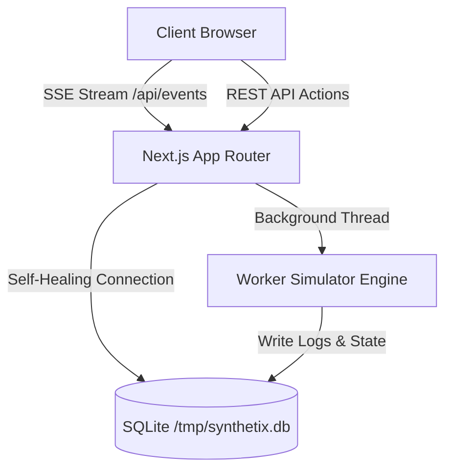

# Synthetix Console

An advanced, production-ready AI Job Monitoring & Notification Platform inspired by GitHub Actions, Linear, Vercel Deployments, and Trigger.dev.

Synthetix Console is engineered for modern AI infrastructure tracking, providing operators with a unified dashboard to monitor worker node pools, stream log outputs in real-time, inspect job executions using AI-powered rule diagnostics, and replay job lifecycles.

---

## 🚀 Overview & Motivation

In modern AI engineering pipelines, jobs are often long-running, resource-intensive, and prone to complex GPU/CUDA failures. Standard logging suites are often too generic for machine learning runtimes.

Synthetix Console bridge this gap by offering:
1. **Live Lifecycle Tracking**: Chronological tracking of jobs transitioning from `Queued` to `Completed` or `Failed`.
2. **Real-time Synchronization**: Ephemeral Server-Sent Events (SSE) connections that sync logs and worker states without bulky polling loops.
3. **AI Failure Diagnostics**: Automated, rule-based suggestion cards explaining GPU failures (e.g. CUDA Out of Memory) with direct developer fixes.
4. **Vercel-ready SQLite Architecture**: Self-healing SQLite connection layers that auto-restore templates to Lambdas `/tmp` directory.

---

## 🏗️ Architecture



---

## 🛠️ Features

* **Real-time Monitoring Dashboard**: SVG charts detailing success/failure rates, aggregated execution timers, and active worker counts.
* **Vim Keyboard Navigation**: Vim-like shortcuts (`J` / `K` for rows, `Enter` to open, `R` to retry, `Esc` to exit) along with standard `⌘K` command palettes.
* **Smart Alert Grouping**: Alerts collapse by status (e.g., "5 Jobs Completed Successfully") with expand toggles.
* **Notification Replay**: Playback controllers simulating the step-by-step history transition of completed/failed executions.
* **Live Scrolling Terminals**: Terminal consoles with pause/resume auto-scroll locks, keyword search, copy, and log downloads.
* **Dark Mode Native**: Complete, zero-flash dark mode native colors.

---

## 📂 Folder Structure

```
├── prisma/
│   ├── schema.prisma   # Relational SQLite definition
│   ├── seed.ts         # Pre-populates workers & default admin
│   └── template.db     # Seeding template copied to /tmp at runtime
├── src/
│   ├── app/
│   │   ├── api/        # Auth, Jobs, Events, Workers, Stats endpoints
│   │   ├── dashboard/  # Main stats page
│   │   ├── jobs/       # Filter lists and spawning modals
│   │   ├── notifications/ # Notification Center
│   │   ├── workers/    # Live node checking
│   │   └── globals.css # Tailwind v4 colors
│   ├── components/     # Modals, sidebars, draw panels, and timelines
│   ├── hooks/          # Keyboard listener shortcuts
│   ├── lib/            # Prisma, JWT verification, and simulator engines
│   └── store/          # Zustand global UI & SSE synchronization
```

---

## ⚙️ Installation & Development

### 1. Prerequisites
* Node.js v20+
* npm

### 2. Setup Env
Create a `.env` file in the root:
```env
DATABASE_URL="file:/tmp/synthetix.db"
JWT_SECRET="your-jwt-secure-development-secret-key"
```

### 3. Build & Run
```bash
# Install dependencies
npm install

# Run database push and seed (creates prisma/template.db)
npm run build

# Start dev server
npm run dev
```

Log in using the seeded credentials:
* **Email**: `admin@synthetix.dev`
* **Password**: `adminpass`

---

## ⌨️ Keyboard Shortcuts

Synthetix Console is fully keyboard-navigable. Press `?` in the app to open the reference sheet:
* `⌘K` or `Ctrl+K`: Toggle Command Palette
* `J` / `K`: Move row selection up/down in queues
* `Enter`: Open details inspector drawer
* `R`: Quick-retry selected job
* `M`: Mark notification as read
* `/`: Focus search input fields
* `?`: Toggle shortcut reference modal
* `Esc`: Dismiss active overlay panels

---

## ☁️ Vercel Deployment

This project builds out-of-the-box on Vercel:
1. Link your repo to Vercel.
2. In Build settings, Vercel will automatically run `npm run build` which runs `prisma generate && next build`.
3. Set your environment variables (`JWT_SECRET`).
4. Vercel Serverless will copy `prisma/template.db` to `/tmp/synthetix.db` during the first API function execution.

---

## 📄 License
MIT License.
