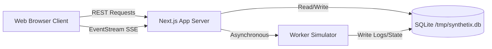

# Architecture Guide

This document describes the architectural layout and process flows of **Synthetix Console**.

---

## 1. System Topology

Synthetix Console is built as a self-contained Next.js 15/16 App Router application.

---

## 2. Serverless SQLite Strategy

To support SQLite on serverless environments (like Vercel) where the file system is ephemeral and read-only (except for `/tmp`):

1. **Pre-Bundled Seeding**: During local or Vercel build time (`npm run build`), we spin up a temporary database, run migrations/pushes, execute `seed.ts` to pre-create workers and admin accounts, and write the static state out to `prisma/template.db`.
2. **Self-Healing Connection Wrapper**: In `src/lib/prisma.ts`, when a route handler or page queries the Prisma client, it checks if `/tmp/synthetix.db` exists.
3. **Restoration**: If the database does not exist in `/tmp` (e.g. on new serverless container cold starts), the wrapper copies `prisma/template.db` to `/tmp/synthetix.db` and assigns correct read/write permissions.

This ensures the database works out-of-the-box instantly, requires no external postgres connections, and is completely self-healing.

---

## 3. Worker Simulator Flow

Since standard serverless routes cannot run persistent background loops, job runs are simulated asynchronously:

1. **Job Dispatch**: When a user creates or retries a job, a `POST` request is sent to the backend.
2. **Asynchronous Trigger**: The Route handler creates the job in `queued` state, schedules a `setTimeout` callback to run in the background thread (unawaited in the main execution promise), and returns a `201 Created` status immediately.
3. **Step-by-Step Transition**: The simulation loop runs:
   - Updates status in database.
   - Writes simulated system log lines (CPU load, network throughput, model validation metrics) to the `Log` table.
   - Appends audit events to the `JobHistory` table.
   - Triggers worker state changes (busy/idle nodes).
4. **Subscriber Broadcast**: Connected clients listen to the Server-Sent Events stream, which queries the database for active updates every 850ms, broadcasting logs and status updates instantly.
